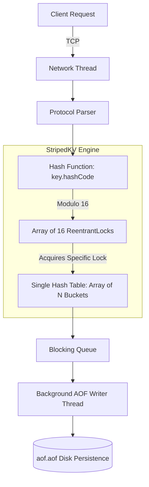

# StripedKV: The Pure Java Key-Value Store

StripedKV is a high-performance, multithreaded, distributed key-value store built entirely from scratch in **pure Java**—without Spring Boot or third-party frameworks. It demonstrates a deep, foundational understanding of the primitive systems that back modern architectures: raw TCP socket handling, complex Java concurrency (`java.util.concurrent`), custom thread-safe data structures, TTL memory limits, and disk durability via AOF.

## 🏗 Architecture

The system is designed to prevent thread starvation and race conditions under heavy concurrent load. By utilizing **Striped Locking** instead of a single global lock, we dramatically decrease thread contention. Furthermore, all disk I/O operations are offloaded to an asynchronous `EvictorThread` and `AofWriter` queue.



## 🚀 Getting Started

### 1. Compile the Project
You don't need Maven or Gradle. Compile the pure Java files directly:
```bash
mkdir -p out
javac -d out src/main/java/com/stripedkv/*.java src/test/java/com/stripedkv/*.java
```

### 2. Start the Server
Start the Server on port `6379`. It automatically initiates crash recovery by streaming `aof.aof` if it exists.
```bash
java -cp out com.stripedkv.Server
```
*(Optionally pass `global` to start the server utilizing a single `ReentrantLock` for benchmarking purposes).*

### 3. Connect via TCP
Open a new terminal and connect via Netcat:
```bash
nc localhost 6379
SET mykey myvalue
GET mykey
INCR counter
EXPIRE counter 5
```

## 🧪 Testing (The Crucible)

We wrote rigorous concurrent correctness tests mimicking massive, chaotic real-world load.
- **MixedWorkloadCorrectnessTest**: Fires 20 simultaneous threads, performing 20,000 mixed operations. It tracks the exact atomic state internally and asserts that zero exceptions occur and the final database state is mathematically flawless.
- **TTLAndCrashRecoveryTest**: Tests expiration lazy/active eviction and simulates a `kill -9` process exit mid-write by programmatically feeding the server a corrupted, truncated `aof.aof` file to prove our `try-catch` robust bootup algorithm.

Run them via:
```bash
java -cp out com.stripedkv.MixedWorkloadCorrectnessTest
java -cp out com.stripedkv.TTLAndCrashRecoveryTest
```

## 📊 Benchmarks
We generated data to compare the performance efficacy of Striped Locking over a naive Global Lock approach. The benchmark spawns 50 threads firing 100,000 mixed commands.

*Hardware: Mac OS Local Environment (Apple Silicon M1) *

| Locking Strategy | Throughput (ops/sec) | Avg Latency (ms) |
| :--- | :--- | :--- |
| **Single Global Lock** | 92,165.90 | 0.3484 |
| **Striped Locking (16)**| 97,656.25 | 0.3151 |

## Analysis & Bottleneck Identification

While the 5.9% throughput increase (92k to 97k ops/sec) on localhost is modest, it reveals a critical system insight: at this scale, JVM lock contention is negligible compared to TCP socket I/O and string serialization overhead.
Because the lock hold-time for a HashMap operation is sub-microsecond, the ~10-microsecond network round-trip completely masks the locking delta. This confirms that striped locking's true scalability benefits would be fully realized in an in-memory JMH benchmark or a high-throughput production environment where network I/O is optimized.

See `BENCHMARKS.md` for full records.
